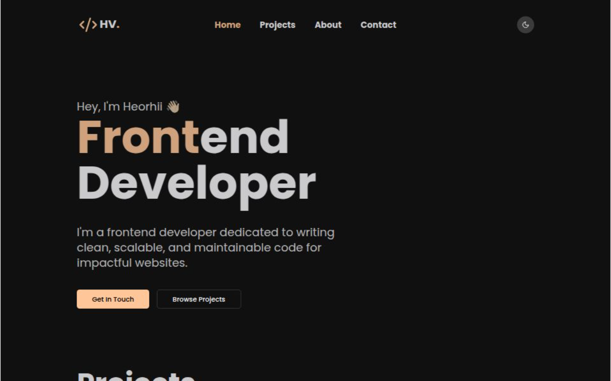

# Portfolio Website



🚀 **Live Demo**: https://valuiskyi.vercel.app/

## 📌 Overview
This is my personal portfolio website, built with modern web technologies to showcase my projects, skills, and experience. It follows the **Atomic Design Pattern** and is optimized for performance and accessibility.

## 🛠️ Tech Stack
- **Framework**: Next.js 15
- **UI Library**: ShadCN (Radix UI-based components)
- **Styling**: Tailwind CSS, Tailwind Merge, Tailwind CSS Animate
- **State Management & Forms**: React Hook Form, Zod
- **Database & Storage**: Firebase (for database and image storage)
- **Utilities**: EmailJS, clsx, hsl-to-hex, html-react-parser
- **Icons**: Lucide React

## 📂 Project Structure
```
portfolio/
│-- src/                     # Source code directory
│   │-- services/            # API calls & external services
│   │-- types/               # TypeScript type definitions
│   │-- providers/           # Context providers
│   │-- hooks/               # General custom React hooks
│   │-- ui/                  # UI components & assets
│   │   │-- components/      # Reusable UI components
│   │   │   │-- templates/   # Page-level components
│   │   │   │-- atoms/       # Basic building blocks
│   │   │   │-- molecules/   # Small combined components
│   │   │   │-- organisms/   # Complex UI structures
│   │   │-- fonts/          # Custom fonts
│   │   │-- icons/          # Icon components
│   │-- styles/              # Global and component styles
│   │-- utils/               # Utility functions
│   │-- configs/             # Configuration files
│   │-- mocks/               # Mock data for testing
│   │-- app/                 # Next.js app directory
│   │-- actions/             # Server-side actions
```

## 🚀 Getting Started
### Prerequisites
- Node.js & PNPM installed

### Installation
```sh
pnpm install
```

### Development
```sh
pnpm dev
```

### Build for Production
```sh
pnpm build
```

### Run Tests
```sh
pnpm test
```

## 🔍 Features
- **Atomic Design Pattern** for scalable UI components
- **Dark Mode Support** using `next-themes`
- **Server-Side Rendering (SSR) & Static Site Generation (SSG)** with Next.js
- **Form validation** using `react-hook-form` & `zod`
- **EmailJS integration** for contact forms
- **Firebase backend** for database & image storage
- **Fully responsive design**

## 🎯 To-Do
- [ ] Add animations 
- [ ] Enhance animations for a smoother UI experience

## 📜 License
This project is licensed under the MIT License.

---
💡 *Feel free to explore the code and reach out with any suggestions or feedback!*

